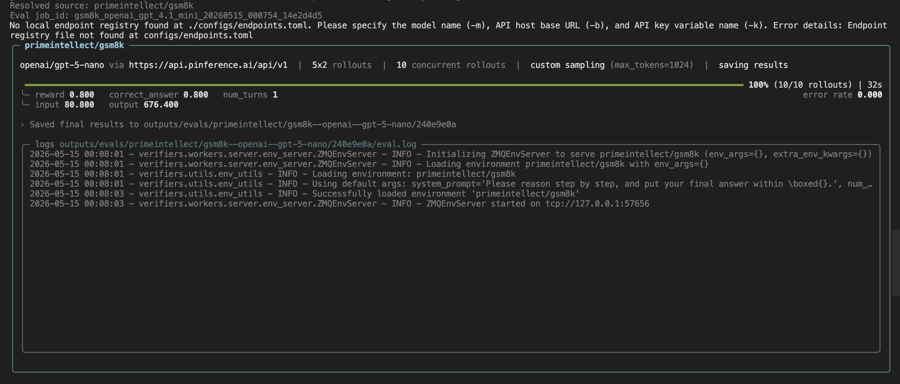
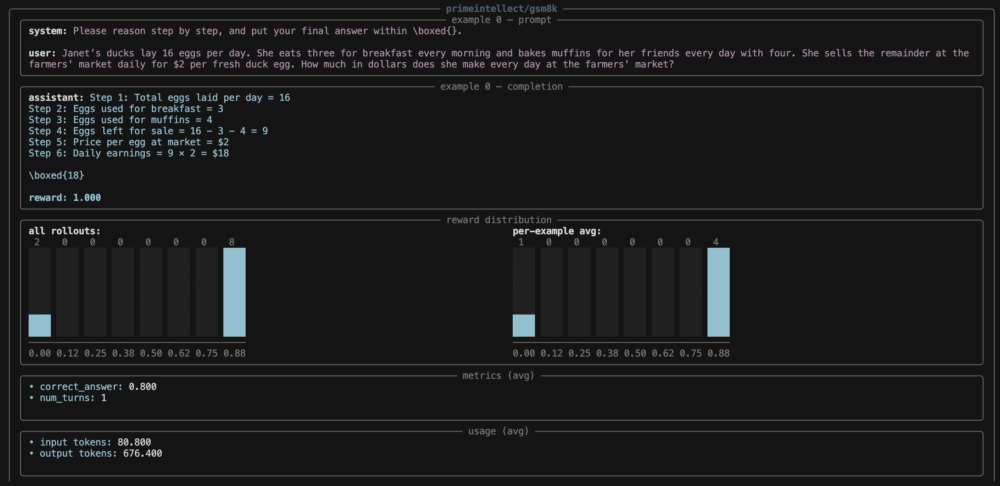
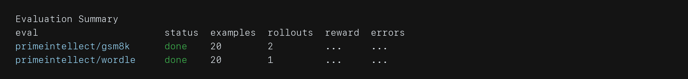

# Environments and Evals

In Lab, evals<a href="../../reference/glossary.md#eval">¹</a> are environments<a href="../../reference/glossary.md#environment">²</a>.

If you've run or read about a benchmark like GSM8K, MMLU, or SWE-bench, you already have the mental model: an eval is a collection of tasks<a href="../../reference/glossary.md#task">³</a> plus a way to score a model's attempts on them. An *environment* is that same unit — tasks and scoring — packaged behind a single entry point so anything in Lab can load it and run rollouts<a href="../../reference/glossary.md#rollout">⁴</a> against it. The name is borrowed from reinforcement learning, where tasks and a reward signal<a href="../../reference/glossary.md#reward-signal">⁵</a> are what a model *trains* against; the choice is deliberate, because in Lab the package you use to grade a model is the same package you'd use to train one. No need to rewrite your evals.

An environment packages the work you want a model or agent to do. It samples tasks, produces rollouts, and computes metrics<a href="../../reference/glossary.md#metric">⁶</a> from the results. The same environment can be used for benchmarking models and prompts, generating synthetic data, optimizing harnesses<a href="../../reference/glossary.md#harness">⁷</a>, and training with RL or other algorithms.

Environments can live locally in your workspace or on the Environments Hub. This guide uses [`primeintellect/gsm8k`](https://app.primeintellect.ai/dashboard/environments/primeintellect/gsm8k), a [Hub](https://app.primeintellect.ai/dashboard/environments) environment.

Later guides also use [`primeintellect/wordle`](https://app.primeintellect.ai/dashboard/environments/primeintellect/wordle), a Hub game environment with clear task state and simple success criteria.

We'll focus on the two pieces you need first: tasks and metrics. In GSM8K, the tasks are math questions with expected final answers. The metric checks whether each rollout reaches the right answer, and that same score can serve as a reward signal during later optimization.

Tools, sandboxes, browser sessions, user simulators, and custom harnesses make environments more powerful, but they are not part of this first eval.

## Evaluate GSM8K

GSM8K is a familiar math eval. It is also a Lab environment, which means you can evaluate any compatible model against it from the CLI.

Run a small eval:

```bash
prime eval run primeintellect/gsm8k \
  -m openai/gpt-5-nano \
  -n 5 \
  -r 2
```

This evaluates 5 examples with 2 rollouts per example. Results are saved automatically.

The terminal summary includes the model, rollout count, average reward, token usage, error rate, and local results path:



Open the Lab viewer to inspect eval results:

```bash
prime lab view --evals
```

This opens the eval results view in Lab.

## Read the Rollouts

Open a few individual rollouts before focusing on the aggregate score. Each rollout shows one model attempt, including the prompt, completion<a href="../../reference/glossary.md#completion">⁸</a>, score, and any task data captured by the environment.

In the rollout view, expect to see the prompt, completion, reward, reward distribution, metrics, and token usage together:



As you read, check whether:

- the model understood the task
- repeated rollouts for the same task behave differently
- failures have an obvious cause
- the score matches your judgment
- any task needs clearer data, constraints, or scoring

This is the basic eval loop: evaluate a model, read the rollouts, and decide whether the task, prompt, model, or metric needs to change.

## Choosing a Model

Here are the factors to think through when selecting a model:

**Size vs. cost vs. latency.** Start small. `Qwen/Qwen3.5-0.8B` or `meta-llama/Llama-3.2-1B-Instruct` cost fractions of a cent per million tokens and return results fast — use them to validate that your environment and reward function work at all. Once they do, move to a mid-range MoE like `Qwen/Qwen3.5-35B-A3B`, which gives strong capability at low active-parameter cost. Reserve the large models (`Qwen/Qwen3.5-397B-A17B`, `nvidia/NVIDIA-Nemotron-3-Super-120B-A12B-BF16`) for production runs and ceiling checks. A useful diagnostic: if swapping from a 0.8B to a 35B model doesn't improve scores, the bottleneck is your environment or tasks, not the model.

**Reasoning controls.** Qwen3.5, Nemotron, and the gpt-oss models all support thinking mode — extended chain-of-thought before the final answer, toggled via `[sampling].enable_thinking`. This helps on multi-step tasks (math, code, logic) but inflates output length and cost. Plain instruct models like the Llama 3.2 family don't have this knob. If you're comparing across families, test thinking models at multiple effort levels so you understand the cost-performance curve, not just the peak.

**Tool-use and JSON reliability.** If your environment involves tool calls or structured output, test your chosen model on a small batch with your actual schemas before scaling up. Some models hallucinate extra fields, wrap JSON in markdown fences, or narrate a tool call in prose instead of emitting structured output. These issues are often fixable with prompt tweaks or a retry wrapper, but you need to know they exist — otherwise your eval measures JSON compliance, not task capability.

**Multimodal support.** Most models on the platform are text-only. If your tasks involve images, screenshots, or diagrams, check that your model accepts vision input before designing the eval around it. See the [Multimodal Environments](../10-multimodal-environments/README.md) guide for how to build environments that pass non-text observations.

**Open vs. closed.** Every model on the platform is open-weights, meaning the eval you build today can become the reward signal for RL training tomorrow. If you also want to benchmark against a closed frontier model (GPT-4o, Claude, Gemini) to establish a performance ceiling, design your environment to work with both from the start. See [Training with RL](../03-training-with-rl/README.md) for how to connect a training-compatible model to the same environments.

## Run a Small Suite

Once you want to run more than one environment in a single pass, move the eval settings into a config file. This keeps the model, sampling settings, and environment arguments together.

Use [`configs/01/first-eval-suite.toml`](../../configs/01/first-eval-suite.toml):

```toml
model = "openai/gpt-5-nano"
save_results = true

[[eval]]
env_id = "primeintellect/gsm8k"
num_examples = 20
rollouts_per_example = 2
sampling_args = { max_tokens = 1024 }

[[eval]]
env_id = "primeintellect/wordle"
num_examples = 20
rollouts_per_example = 1
sampling_args = { max_tokens = 1024, temperature = 0.7 }
```
The `save_results`<a href="../../reference/glossary.md#save-results">¹⁰</a> field keeps the run visible after it finishes.


Run the suite:

```bash
prime eval run configs/01/first-eval-suite.toml
```

Expected output:



Use this pattern when you want to compare model behavior across environments, compare a base model to a trained adapter, or re-run the same checks after changing a prompt or config.

## Next

In [Building Your First Environment](../02-building-your-first-environment/README.md), you will build a small environment yourself and use evals to check whether it is ready for training.
