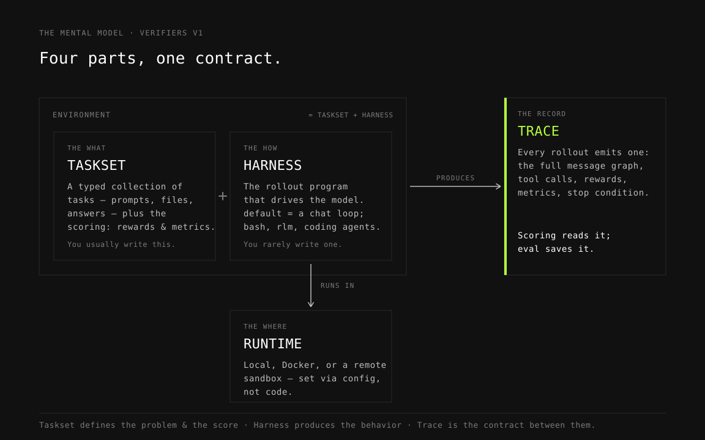

# 01 — Environments and Evals

In this guide you will run your first evaluations and learn the four concepts that everything else in this cookbook builds on. By the end you will know how to run an eval from a config file or from CLI flags, where the results land, and how to read a trace.

## The mental model



A Verifiers v1 **environment** is the combination of a *taskset* and a *harness*:

- **Taskset** — the *what*: a typed collection of tasks (prompts, files, answers), plus the scoring logic (rewards and metrics) and, optionally, tools and a user simulator. This is the part you usually write.
- **Harness** — the *how*: the rollout program that drives the model. The built-in `default` harness is a plain chat loop; others wrap real agent scaffolds (`bash`, `rlm`, or coding agents like Codex). Tasksets are meant to work with any compatible harness, so you rarely write one yourself.
- **Runtime** — the *where*: harnesses and their colocated pieces run in a runtime — a local subprocess for debugging, Docker, or a remote sandbox for production. Chosen via harness/runtime config, not code.
- **Trace** — the *record*: every rollout produces a `Trace` holding the full message graph, tool calls, rewards, metrics, and stop condition. Scoring reads the trace; eval saves it.

Keep this separation in mind: the taskset defines the problem and the score, the harness produces behavior, and the trace is the contract between them.

## Run your first eval

Firstly, a config is defined as a TOML file, where you can specify all the parameters for your evaluation. The config is intentionally small:

```toml
model = "openai/gpt-5.4-nano"   # which model to evaluate
num_tasks = 10                  # how many tasks from the taskset
num_rollouts = 2                # attempts per task

[sampling]
max_tokens = 1024               # generation params passed to the model

[taskset]
id = "gsm8k"                    # which taskset to load
```

Since no `[harness]` is given, the built-in `default` chat-loop harness will be used. Once you've defined the config, you can run the eval:

```bash
prime eval run @ configs/01/first-eval.toml
```

 Every config value has a CLI twin using dotted names, so this is exactly equivalent:

```bash
prime eval run gsm8k -n 10 -r 2 --model openai/gpt-5.4-nano --sampling.max-tokens 1024
```

You can mix the two: CLI arguments override TOML values when both are present. This is handy for one-off tweaks, e.g. `prime eval run @ configs/01/first-eval.toml -n 2` for a quick smoke test before you commit to updating the config. Add `--dry-run` to validate a config without calling the model.

## Read the output

Each run writes to `outputs/<taskset>--<model>--<harness>/<uuid>/`:

- `config.toml` — the fully-resolved config that was actually used
- `results.jsonl` — one serialized `Trace` per rollout
- `eval.log` — logs from the run and its workers

Open `results.jsonl` and look at a single trace. Rewards read the trace, not an ad hoc completion dict, so these are the fields you will inspect most often:


| Field                             | What it tells you                                |
| --------------------------------- | ------------------------------------------------ |
| `trace.task`                      | The task this rollout ran (prompt, answer, ...)  |
| `trace.assistant_messages`        | What the model said                              |
| `trace.tool_messages`             | Tool calls and their results                     |
| `trace.state`                     | Environment state accumulated during the rollout |
| `trace.info`                      | Free-form diagnostic info                        |
| `trace.rewards` / `trace.metrics` | Scored and unscored measurements                 |
| `trace.stop_condition`            | Why the rollout ended                            |


When a reward looks wrong, this is where you debug: find a trace with an unexpected score and walk from `assistant_messages` to `rewards`.

If a run crashes or you hit rate limits, `--resume <output-dir>` re-runs only the missing or errored rollouts, appending to that run's `results.jsonl`.

## A multi-turn example

`gsm8k` finishes in one assistant turn. Other environments, such as Wordle, do not — the model guesses, gets feedback, and guesses again. Run it:

```bash
prime eval run @ configs/01/first-eval-suite.toml
```

```toml
model = "openai/gpt-5.4-nano"
num_tasks = 20
num_rollouts = 1
max_turns = 6                   # <- new: cap the conversation length

[sampling]
max_tokens = 1024

[taskset]
id = "wordle"

[harness]
id = "default"
```

Two things changed. The config now names the harness explicitly (still `default` — the chat loop handles multi-turn fine), and it sets `max_turns = 6`. Set `max_turns` at the env config level like this, not inside the taskset: the framework enforces it uniformly across harnesses, so a rollout can never loop forever regardless of which harness runs it.

Look at a Wordle trace afterwards and compare it to a gsm8k trace: you will see multiple assistant turns interleaved with feedback, and `trace.stop_condition` tells you whether the game was solved or the turn cap hit.

## Try it

- Re-run the gsm8k eval with `--sampling.temperature 1.0` and compare mean rewards across the two output folders.
- Bump Wordle's `max_turns` to 8 via the CLI (`--max-turns 8`) and see whether the extra turns help.


## Next

→ [02 — Building Your First Environment](../02-building-your-first-environment/README.md): write the taskset side yourself — typed tasks, a stop condition, and a reward.