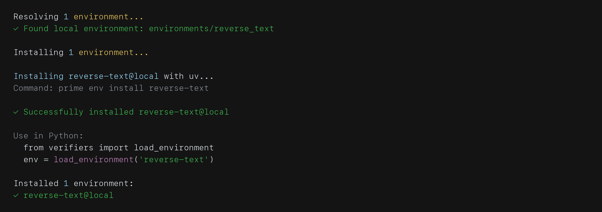
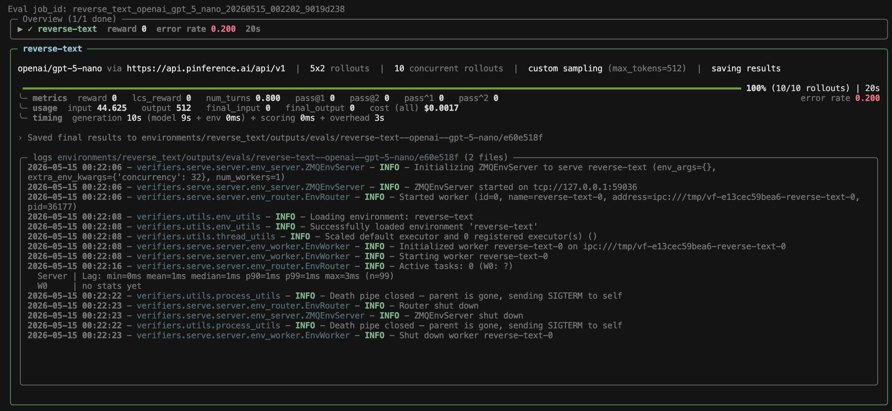
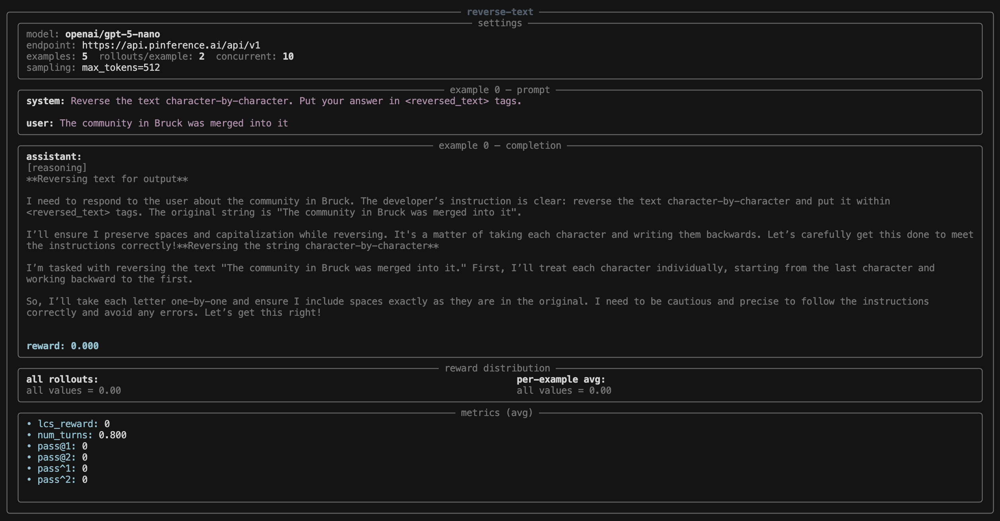

# Building Your First Environment

Build a local environment and evaluate it with Lab.

The task is simple to state and surprisingly hard to solve: given a piece of text, return the characters in reverse order. Even capable models drop characters or reverse word-by-word, and accuracy falls sharply without chain-of-thought. The payoff is a clean continuous reward — longest-common-subsequence between the model's answer and the true reversal — that is robust to reward hacking and trains quickly under RL.

You will build this as `reverse-text`. You can also inspect the finished Hub environment at [primeintellect/reverse-text](https://app.primeintellect.ai/dashboard/environments/primeintellect/reverse-text).

## Create the Package

From your Lab workspace, scaffold a local environment package:

```bash
prime env init reverse-text
```

The scaffold command may return quietly. Check that it created `environments/reverse_text/` with a starter `reverse_text.py`, `pyproject.toml`, and README.

This creates `environments/reverse_text/` with a starter `reverse_text.py` and `pyproject.toml`. Open `reverse_text.py` — you will replace its contents as you go.

## Define Your Tasks

The first thing an environment needs is some tasks for the model to attempt. Here, we'll use [PrimeIntellect/Reverse-Text-RL](https://huggingface.co/datasets/PrimeIntellect/Reverse-Text-RL). Each row gives you a piece of text:

```python
{"prompt": "The quick brown fox jumps over the lazy dog."}
```

Build a chat-style `prompt` from the text and pair it with the reversed `answer` the model should produce:

```python
from datasets import load_dataset


DATASET_NAME = "PrimeIntellect/Reverse-Text-RL"


def source():
    rows = []
    for row in load_dataset(DATASET_NAME, split="train"):
        text = row["prompt"]
        rows.append({
            "prompt": [{"role": "user", "content": text}],
            "answer": text[::-1],
        })
    return rows
```

The taskset will call `source` once and cache the rows.

## Add a Reward

Tell the model where to put its answer with a system prompt:

```python
SYSTEM_PROMPT = (
    "Reverse the text character-by-character. Put your answer in "
    "<reversed_text> tags."
)
```

A reward is an `async` function decorated with `@vf.reward`. It receives the immutable `task` and the state produced by the rollout, and returns a float. Pull the tagged answer out of the model's reply and score it against the true reversal with a longest-common-subsequence ratio, so partial answers get partial credit:

```python
from difflib import SequenceMatcher

import verifiers.v1 as vf


@vf.reward(weight=1.0)
async def lcs_reward(task, state) -> float:
    text = state["completion"][-1]["content"]
    response = text.split("<reversed_text>", 1)[-1].split("</reversed_text>", 1)[0].strip()
    return SequenceMatcher(None, response, task["answer"]).ratio()
```

If either tag is missing, the splits fall through to the raw completion.

## Wire It Together

A single `load_environment` ties the pieces together. It takes one argument — `config: vf.EnvConfig` — and wires the taskset and harness in one expression:

```python
def load_environment(config: vf.EnvConfig) -> vf.Env:
    return vf.Env(
        taskset=vf.Taskset(
            source=source,
            system_prompt=SYSTEM_PROMPT,
            rewards=[lcs_reward],
            config=config.taskset,
        ),
        harness=vf.Harness(config=config.harness),
    )
```

By default, `vf.Env` sends each prompt to the model and hands the response back to the taskset for scoring. `vf.Harness` accepts the harness slice of the run-time config (sampling, max turns, etc.) so per-run knobs flow through evaluation/RL TOMLs.

## Check the Package

Make sure `environments/reverse_text/pyproject.toml` declares the entrypoint and dependencies:

```toml
[project]
name = "reverse-text"
version = "0.1.0"
description = "Reverse text character by character."
requires-python = ">=3.11"
dependencies = [
    "verifiers",
    "datasets",
]

[build-system]
requires = ["hatchling"]
build-backend = "hatchling.build"

[tool.hatch.build]
include = ["reverse_text.py", "pyproject.toml"]

[project.entry-points."verifiers.environments"]
reverse-text = "reverse_text:load_environment"

[tool.verifiers.eval]
num_examples = 20
rollouts_per_example = 2
```

Install the environment into your workspace:

```bash
prime env install reverse-text
```

Expected output:



## Evaluate It

Run a small eval:

```bash
prime eval run reverse-text \
  -m openai/gpt-5-nano \
  -n 5 \
  -r 2 \
  -t 512
```

The exact reward will vary by model and sample, but the summary should show saved results, rollout count, reward metrics, usage, cost, and any error rate:



The rollout view is useful because it shows the prompt, completion, reward distribution, and reward-specific metrics together:



Open the Lab viewer:

```bash
prime lab view --evals
```

This opens the eval results view in Lab.

Read a few rollouts. For reverse-text, check whether the model copied the string forward, reversed only words, dropped punctuation, or produced the right characters in the wrong order. `lcs_reward` tells you how close it got.

## Designing Rewards

`lcs_reward` is the easy case: a deterministic, continuous reward function with a single weight of 1.0. Most real environments need more.

**Rule-based vs. judged.** Use deterministic checks — string match, regex, math-verify, test execution — whenever you can. They're fast, free, and reproducible. Reach for an LLM judge only when correctness can't be reduced to a programmatic check: open-ended generation, style, or tasks where valid answers are too numerous to enumerate. If you can write a unit test for it, don't judge it.

**Combining rewards.** A `vf.Rubric` can hold multiple reward functions with explicit weights. A common pattern is layering a cheap deterministic check (did it parse? did the tests pass?) with an expensive judged check (is the explanation clear?). Set weights so the deterministic signal dominates and the judge nudges — e.g. `weights=[1.0, 0.2]`. Invert this and the model learns to please the judge at the expense of being correct. For combining rubrics of different types — say a `vf.MathRubric` with a `vf.JudgeRubric` — wrap them in a vf.RubricGroup, which aggregates all rewards and metrics.

**Continuous vs. binary.** Continuous rewards like LCS give partial credit and produce smoother gradients. Binary rewards (1.0 or 0.0) are easier to interpret and harder to hack, but give the optimizer no signal about how close a wrong answer was. Use binary when correctness is unambiguous (test pass/fail, exact match). Use continuous when there's a meaningful notion of "almost right."

**JudgeRubric basics.** When you need a judge, configure a vf.JudgeRubric with a `judge_model` and optionally a `judge_prompt` template. The rubric exposes a `judge` callable to your reward functions. Write the prompt like a grading rubric: enumerate what good and bad answers look like. Vague prompts produce noisy scores, and noise in the reward is noise in the gradient.

**Reward hacking.** Expect it, don't hope to avoid it. Classic examples: a keyword bonus the model learns to stuff into every response, a judge that rewards verbosity, a length reward that accidentally flips the gradient. The fix is always the same: sort rollouts by reward, read the top-scoring ones, and ask whether a human would agree. If the highest-rewarded rollout is obviously bad, your reward is broken.

**Metrics vs. rewards.** Not every signal should affect training. Use `rubric.add_metric()` to register reward functions with `weight=0`. They track response length, format compliance, tool-call count, or whatever you want to monitor without injecting signal into the gradient. These show up in rollout metrics and make hacking easier to spot: if training reward climbs but your weight-0 quality metric is flat, something is wrong.

## Troubleshooting & QA

Before you push an environment or launch training, run a small QA pass.

- **Smoke-eval first.** Run `prime eval run <env> -m <small model> -n 5 -r 2` and open the rollouts. If the model gets every example right or every example wrong, the environment is not ready.
- **Read the rollouts, not just the score.** Look for: prompt shape (system + user as expected), reward matches your judgment, tasks the model can't possibly solve, tasks the model trivially solves.
- **Common bugs.**
  - Dataset rows shaped wrong (e.g. `prompt` is a string when it should be a list of messages).
  - Reward function silently returning `0.0` on a parse failure — add a metric for "parsed successfully" with `weight=0`.
  - Sync HTTP/LLM clients inside reward functions or `env_response` — these block the event loop and serialize concurrent rollouts. Use `AsyncOpenAI`, `httpx.AsyncClient`, or `asyncio.to_thread` for unavoidable sync calls.
  - `info` shape changing between rows — store as a JSON string when rows have different schemas.
  - Judge prompts that return prose instead of a score — fail loudly during eval, not silently in training. If the answer needs extraction, use a parser rather than ad hoc string slicing.
- **Spread of rewards.** Across the smoke eval, you want a spread, not all-0 or all-1. If the distribution is collapsed, fix the task difficulty or the reward before training.
- **Re-run on a second model.** Confirm the environment isn't accidentally tuned to one model family's quirks.

When all of the above looks clean, the environment is ready for [Training with RL](../03-training-with-rl/README.md).

## Why This Environment Works

Reverse-text has a clear task, a deterministic answer, and a graded reward. That makes it a good first training target:

- the task is easy to generate at scale
- failures are easy to inspect
- partial credit gives the model a learning signal even before it fully solves the task

The next guide uses this same environment to launch an RL run and watch reward improve.
