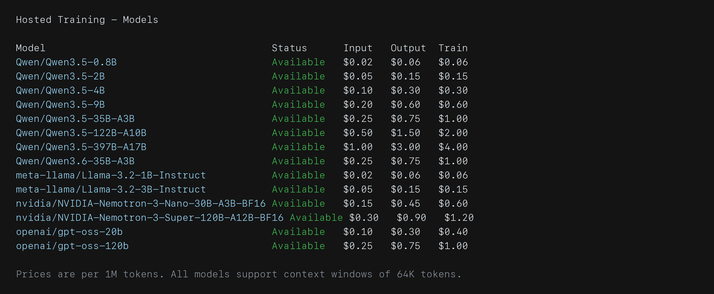

# Training with RL

Launch a Hosted Training<a href="../../reference/glossary.md#hosted-training">¹</a> run with an environment.

RL is useful once an environment has a reward signal you trust. The model samples multiple rollouts for each task, the environment scores those rollouts, and the trainer updates the model's policy<a href="../../reference/glossary.md#policy">²</a> toward higher-reward behavior.

For the first run, use the Hub version of the reverse-text environment. If you built a local version in the previous guide, using the Hub copy keeps training stable while you keep iterating on your local copy.

## Check the Baseline

Run a small eval before training to establish the baseline<a href="../../reference/glossary.md#baseline">³</a>:

```bash
prime eval run primeintellect/reverse-text \
  -m openai/gpt-5-nano \
  -n 10 \
  -r 2 \
  -t 512
```

Expect the same eval summary shape as the local reverse-text eval: a run id, rollout progress, reward metrics, token usage, cost, and a saved results path. This baseline is useful when the reward is neither already perfect nor completely uninformative.

Open the eval results:

```bash
prime lab view --evals
```

This opens the eval results view in Lab.

Look for two things before launching training:

- the reward is not already perfect
- the rollouts show fixable mistakes, not broken prompts or broken scoring

If the model gets every example right, there is little to learn. If every score is zero and the rollouts look unrelated to the task, fix the environment or prompt before training.

## Choose a Training Model

See the current Hosted Training models with:

```bash
prime train models
```

The command prints the current Hosted Training model table:



Hosted Training currently supports these model families:

- **gpt-oss**: reasoning MoE models with effort control.
- **Qwen 3.5 / 3.6**: dense and MoE models; natively multimodal.
- **Nemotron 3**: hybrid reasoning MoE models.
- **Llama 3.2 Instruct**: dense instruct models.

Reasoning controls go directly under `[sampling]`:

```toml
[sampling]
max_tokens = 512
reasoning_effort = "medium" # gpt-oss: low, medium, high
```

For `gpt-oss`, `reasoning_effort` can be `"low"`, `"medium"`, or `"high"`. The default is `"medium"`.

For Nemotron 3 and Qwen 3.5 / 3.6, use `enable_thinking`<a href="../../reference/glossary.md#enable-thinking">⁴</a>:

```toml
[sampling]
max_tokens = 512
enable_thinking = true # Nemotron 3 and Qwen 3.5 / 3.6
```

The default is `true`. Set it to `false` when you want shorter, more direct responses or want to compare thinking and non-thinking rollouts.

## Hyperparameters and Intuitions

Status: TODO

For a first run, the config below is intentionally small. Once it works, these are the knobs that change run behavior most, in roughly the order you'll want to think about them.

TODO: turn each bullet into a paragraph with concrete intuitions and failure modes.

- **`rollouts_per_example`.**<a href="../../reference/glossary.md#rollouts-per-example">⁵</a> How many attempts the trainer samples per task. RL learns from advantage<a href="../../reference/glossary.md#advantage">⁶</a> across rollouts in the same group, so this can't be 1. Typical range 4–16. Higher → cleaner gradient<a href="../../reference/glossary.md#gradient">⁷</a> signal, more compute per step. Drop it when rollouts are expensive (long contexts, sandboxes); raise it when the reward is noisy or the model is exploring<a href="../../reference/glossary.md#exploration">⁸</a>.
- **`batch_size`.**<a href="../../reference/glossary.md#batch-size">⁹</a> Total rollouts consumed per step. Bigger batches stabilize learning and make reward curves smoother; smaller batches step faster but noisier. Keep `batch_size` a multiple of `rollouts_per_example` so sample throughput<a href="../../reference/glossary.md#sample-throughput">¹⁰</a> stays predictable.
- **Learning rate.**<a href="../../reference/glossary.md#learning-rate">¹¹</a> Default is usually right. If reward collapses or oscillates wildly in the first 20 steps, the LR is too high. If it plateaus from the start and never moves, it may be too low.
- **KL / clip controls.**<a href="../../reference/glossary.md#kl">¹²</a> These keep the policy from drifting too far from the reference model<a href="../../reference/glossary.md#reference-model">¹³</a>. Loosen them if learning stalls because the model can't change enough; tighten them if policy drift<a href="../../reference/glossary.md#policy-drift">¹⁴</a> makes the model degrade on out-of-distribution prompts during training. Clip controls<a href="../../reference/glossary.md#clip-ratio">¹⁵</a> limit abrupt policy updates.
- **`max_tokens` and reasoning effort.** Reasoning models need enough budget to think *and* produce the answer. If completions are getting truncated mid-answer, raise `max_tokens`<a href="../../reference/glossary.md#max-tokens">¹⁶</a> before changing anything else. Reasoning effort<a href="../../reference/glossary.md#reasoning-effort">¹⁷</a> trades cost for capability — start at `"medium"` and only move up if the smaller setting hits a ceiling.
- **Eval cadence.**<a href="../../reference/glossary.md#eval-cadence">¹⁸</a> How often a held-out eval<a href="../../reference/glossary.md#held-out-eval">¹⁹</a> runs during training. Frequent enough to catch regressions, sparse enough to not dominate cost. Configure under `[[eval]]` once the basic loop is working.
- **Difficulty filtering and oversampling.** When most tasks are too easy or too hard, the training signal<a href="../../reference/glossary.md#training-signal">²⁰</a> is wasted. Online difficulty filtering<a href="../../reference/glossary.md#online-difficulty-filtering">²¹</a> and oversampling<a href="../../reference/glossary.md#oversampling">²²</a> help control which tasks the run sees. The `train-with-environments` skill covers this in depth.

The general intuition: change one knob at a time, watch the rollouts, and compare against the previous run's curves. The [Choosing a Model](../01-environments-and-evals/README.md#choosing-a-model) section in 01 covers model-level tradeoffs that show up here too.

## Write a Training Config

Create `configs/rl/reverse-text.toml`:

```toml
model = "openai/gpt-oss-20b"
max_steps = 100

batch_size = 128
rollouts_per_example = 8

[sampling]
max_tokens = 512
reasoning_effort = "medium"

[[env]]
id = "primeintellect/reverse-text"
```

The main fields are:

- `model`: the base model to train.
- `max_steps`: how long the run should train before stopping.
- `batch_size`: the number of rollout samples consumed per training step.
- `rollouts_per_example`: how many attempts to sample for the same task.
- `[sampling]`: generation settings used during rollout collection, including reasoning controls.
- `[[env]]`: the environment or environments used for training.

For a first run, keep the config small. Bigger batches, more rollouts, validation<a href="../../reference/glossary.md#validation">²³</a>, evals, W&B, and checkpoint<a href="../../reference/glossary.md#checkpoint">²⁴</a> policies can come later once the basic learning loop is working.

## Example Run Costs

The table below shows observed costs from small Hosted Training runs. Treat these as rough reference points rather than quotes: pricing can change, and the final cost depends on the model, rollout length, token usage, and any extra evals or logging you enable. Each run used the same small training shape: `max_steps = 100`, `batch_size = 128`, `rollouts_per_example = 8`, and `max_tokens = 1024`.

| Environment | Model | What it shows | Observed cost |
|---|---|---|---:|
| `primeintellect/reverse-text` | `meta-llama/Llama-3.2-1B-Instruct` | Cheapest baseline text-only RL run | $0.14 |
| `primeintellect/reverse-text` | `Qwen/Qwen3.5-0.8B` | Same task on a similarly small Qwen model | $0.14 |
| `primeintellect/reverse-text` | `meta-llama/Llama-3.2-3B-Instruct` | Same task on the next Llama size up | $0.35 |
| `primeintellect/reverse-text` | `Qwen/Qwen3.5-2B` | Same task on a small dense Qwen model | $0.54 |
| `primeintellect/wordle` | `meta-llama/Llama-3.2-1B-Instruct` | Same small model on a multi-turn game | $0.73 |
| `primeintellect/reverse-text` | `Qwen/Qwen3.5-4B` | Same task on a larger dense Qwen model | $3.24 |

The main pattern is that text-only runs on the smallest models can stay well under a dollar, while multi-turn environments and larger models move the cost up quickly. For the current per-token model prices, run `prime train models` before launching a larger experiment.

## Launch Training

Start the run:

```bash
prime train configs/rl/reverse-text.toml
```

The command prints a run ID along with the command for streaming logs from the new Hosted Training run. Follow logs with:

```bash
prime train logs <run_id> -f
```

Early logs should show the run starting, the environment loading, rollout collection beginning, and step-level training metrics. Repeated environment errors here usually mean the environment or secrets need fixing before you wait on the run.

Open the Lab viewer to follow training:

```bash
prime lab view --training
```

This opens the Hosted Training view in Lab, where you can follow run status, logs, reward curves, loss curves, checkpoints, and online evals if configured.

## Decide Whether It Is Learning

Early in the run, watch for:

- reward moving upward over time
- rollout samples becoming more consistent
- completions following the expected answer format
- no repeated environment errors in the logs
- no obvious reward bug where bad completions receive high scores

For reverse-text, the first "aha" is usually visible in rollouts before it is obvious from aggregate metrics: the model starts reversing more characters in the right order, then exact matches become more common.

## Advanced Configs

Once the basic run is learning, the same config can be extended with a few common knobs. See [Advanced Configurations](https://docs.primeintellect.ai/hosted-training/advanced-configs) for the full reference.

### Sampling Temperature

Set `temperature`<a href="../../reference/glossary.md#temperature">²⁵</a> under `[sampling]`<a href="../../reference/glossary.md#sampling">²⁶</a> to control rollout diversity. The default is `1.0`; raise it slightly to encourage exploration when rollouts within a group look too similar.

```toml
[sampling]
max_tokens = 512
temperature = 1.1
```

### Multiple Environments

Add more `[[env]]` sections to train across environments at once, and use `[buffer].env_ratios`<a href="../../reference/glossary.md#env-ratios">²⁷</a> to set the mix:

```toml
[[env]]
id = "primeintellect/reverse-text"

[[env]]
id = "primeintellect/wordle"

[buffer]
env_ratios = [0.5, 0.5]
```

The ratios match the order of the `[[env]]` sections.

### Online Evaluation

Add an `[eval]` block to evaluate periodically during training without stopping the run:

```toml
[eval]
interval = 25
num_examples = 64
rollouts_per_example = 1
eval_base_model = true

[[eval.env]]
id = "primeintellect/reverse-text"
```

Results show up alongside training metrics in `prime lab view --training`. Use `eval_base_model = true` on the first run with a new environment to anchor the curve against the untrained model.

## Next

In [Warm Starts with SFT](../04-warm-starts-with-sft/README.md), you will use SFT to give a model a stronger starting policy before RL.
